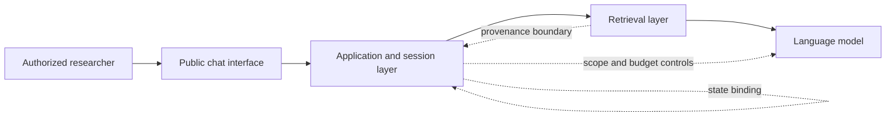

# ParkerBot Red Team

Responsible LLM security case study covering an adversarial assessment of a
public Parker Solar Probe informational chatbot.

> **Release status:** public portfolio case study. Raw evidence, replay details,
> and third-party code remain intentionally withheld.

## Executive summary

This assessment asked a practical question: can a public retrieval-augmented
chatbot preserve conversation boundaries, separate untrusted user text from
retrieved evidence, avoid implementation disclosure, enforce scope early, and
bound retrieval cost under adversarial input?

The evaluation used 505 scored jobs across protocol, scope, disclosure,
conversation state, retrieval trust, output format, and model-safety families.
It attempted 548 chat turns, received 500 successful HTTP responses, and
recorded approximately 13 million reported tokens.

Most important result was nuanced:

- Model-level safeguards held on all 200 direct harmful-request tests according
  to automated judging and manual spot review.
- Material findings instead clustered around application boundaries: state
  binding, retrieval provenance, metadata exposure, scope enforcement, and
  resource controls.

Findings were responsibly reported through NASA's Vulnerability Disclosure
Policy. NASA issued Arth Singh a
[Letter of Recognition](artifacts/NASA-VDP-Letter-of-Recognition.pdf) dated
June 5, 2026.

Recognition confirms responsible reporting. It is not NASA endorsement of this
repository or independent validation of every severity assessment.

## Scope

Assessment covered a third-party public chatbot serving Parker Solar Probe
information. It did **not** involve access to NASA internal networks, spacecraft
systems, privileged infrastructure, or a general NASA API.

No live target URL, tenant identifier, conversation identifier, raw browser
capture, replay-ready request, harmful prompt, response body, proprietary
assessment harness, or private disclosure correspondence appears here.



## Method

1. Established normal, in-scope baseline behavior.
2. Observed public browser traffic to understand application boundaries.
3. Defined repeatable protocol, scope, disclosure, state, retrieval, format,
   and safety test families.
4. Used fresh conversation state except when explicitly evaluating state
   binding.
5. Recorded status, latency, source metadata, judge outcome, and token telemetry.
6. Combined automated scoring with manual review for high-impact cases.
7. Minimized public evidence and followed coordinated disclosure.

Automated judge labels were triage signals, not final vulnerability severity.

## Sanitized findings

### 1. Conversation state required stronger binding

Client-visible state could be reused across otherwise independent clients.
Defensive pattern: bind state to an authenticated or unforgeable capability,
expire it quickly, and prevent identifiers from entering logs or telemetry.

### 2. Retrieval data and instructions needed explicit separation

User text shaped like retrieved evidence could influence trust decisions.
Defensive pattern: typed trust boundaries, server-generated provenance,
instruction/data separation, and citation validation.

### 3. Implementation metadata was overexposed

Some responses revealed internal tool or retrieval metadata.
Defensive pattern: strict output schemas, metadata filtering, and disclosure
regression tests.

### 4. Scope checks occurred too late

Some unrelated requests reached retrieval or generation before rejection.
Defensive pattern: cheap deterministic gates before retrieval, tools, and model
inference.

### 5. Token amplification created cost and availability risk

Some long-context cases produced disproportionate retrieval and token use.
Defensive pattern: per-turn budgets, retrieved-context caps, rate limits,
cancellation, and anomaly alerts.

## Included code

Repository intentionally includes only a small, independently written offline
analyzer:

- [`tools/summarize_results.py`](tools/summarize_results.py) aggregates a
  content-free result schema.
- [`data/sample_results.jsonl`](data/sample_results.jsonl) contains synthetic
  records only.
- [`tests/test_summarize_results.py`](tests/test_summarize_results.py) verifies
  aggregation and rejects raw prompt/response fields.
- [`data/aggregate_results.json`](data/aggregate_results.json) records only
  high-level, sanitized engagement measurements.

Run it:

```bash
python tools/summarize_results.py data/sample_results.jsonl --pretty
python -m unittest discover -s tests -v
```

## Responsible release boundary

See [`docs/RELEASE_BOUNDARY.md`](docs/RELEASE_BOUNDARY.md). Private originals
remain withheld. This repository cannot reproduce requests against a live
system.

## Portfolio summary

Application-ready descriptions live in
[`docs/APPLICATION_BLURB.md`](docs/APPLICATION_BLURB.md).
